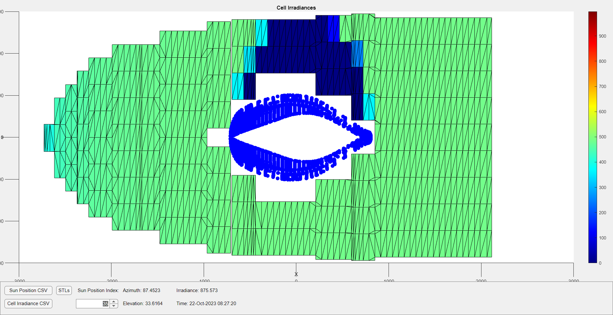

# Array Simulation

This array simulation aims to simulate the power output of a solar car array across a variety of azimuth/elevation positions. It first generates effective irradiances on cells and simulates the electrical layout of the array via. a simulink model. Before running the following steps, please make sure that the you have an stl file for the canopy and an stl file for **each** array cell named with ascending integers ex. NA(1).stl . You can do this from spaceclaim and export by bodies

1. Generate an n x 3 csv that describes sun position and irradiances to simulate ```Azimuth(Degrees) | Elevation(Degrees) | Irradiance(W/m^2)``` This can be done by running ```python dayAzElIrr.py <lat> <lon> <utc start time> <utc end time> <bearing> <number of timesteps>``` in ./GetSunPosition in order to simulate the car's power input throughout a day at some static location on earth. You could also manually generate one if you have a more specific configuration. The former is generally used in order to compute array layout performances against one another and the latter is used in order to compute a lookup table for the selected array. 
    - Convention: Azimuth is taken to be degrees clockwise from true north and can range from 0 to 360. Elevation ranges from 0 to 90.

2. Generate an (n x number of cells) where the value at index (i,j) is the effective irradiance in W/m^2 on cell j when the sun is positioned according to row i in the csv from step 1. Canopy and array shading are taken into account by using an external ray-tracing algorithm in order to compute obstructions from the sun to each cell of the array. This csv can be generated by running ```./GetCellIrradiance/main(<number of cells>, <bearing of the car>, <output csv name>, <Path to canopy stl>, <Path to array cell stls>, <Path to input csv>)```. Before this, you must compile the mesh ray tracing library by going to ./src_matlab and running mexall.m which compiles the mex code and copies it to the ./B/Run folder. You may need to modify the compile command in ```mexall.m``` to be compatible with your C++ compiler. Generally, the compiler that comes with the mingw_w64 MATLAB add-on works smoothly. Refer to https://www.mathworks.com/help/matlab/matlab_external/install-mingw-support-package.html for installation.
    - Convention: The stl of the car MUST be oriented such that the nose of the car points in one of the +/- x, y directions while the canopy must be pointing in the +z direction. Bearing of the car is taken to be the degrees from true north.

    - Warning: The cells **MUST** be named ```NA(<int>).stl``` for the following visualization to work properly.

    - After running the algorithm, you can visualize the irradiance by running the ```visualize_irradiance.mlapp``` MATLAB app. First select the folder containing all the STLs of the array and the canopy. Then, select the csv generated from step 1 describing sun positions and finally, the csv generated from step 2 describing cell irradiances. 
    

3. Get the total power output of the entire array in W by feeding the output csv from step 2 into a custom simulink model that simulates either bypass diodes or mppt controllers. This simulink model must be custom made for each array layout in order to adhere to string configurations. If your strings are composed of a series connection of substrings, you can generate it based off a json file by running ```./BypassDiodeSim/generate_bypass_diode_model(<model_name>, <.json layout>)```

# Limitations

- Canopy is interpreted as opaque in step 2. In practice, this isn't too big of an issue since a large amount of the volume would be blocked by the driver and rollcage.
- Solar cells are used for 100% of their area. However, most silicon cells have a very small gap between the edge of the cell and the actual edge of the silicon
- Step 3 does not factor in performance under temperature
- Step 2 is slow due to the inability to parallelize the .mex file